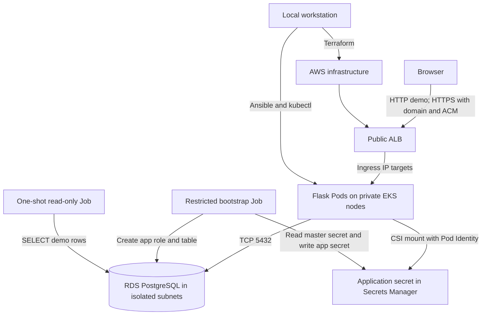

# Architecture decision and ownership

The VPC spans two Availability Zones. Each zone has a public subnet for the ALB, a private subnet for EKS managed nodes/Pods, and an isolated database subnet for RDS. Public subnets route through an Internet Gateway. Application private subnets use one NAT gateway initially to reach container registries and AWS endpoints; this is a cost/reliability tradeoff for a short-lived demonstration. Database subnets have no default internet route. Nodes have no public IPs. Tags on public subnets permit ALB discovery.

## Traffic and permission boundaries

| Source | Destination | Allowed access |
| --- | --- | --- |
| Internet | ALB | TCP 443 if ACM certificate/domain exists; otherwise temporary demo TCP 80 |
| ALB security group | EKS Pod targets | Application port only, via target-group traffic |
| Flask Pods / node network | RDS security group | TCP 5432 only |
| Flask service account | Application secret ARN | `secretsmanager:GetSecretValue`, `DescribeSecret` only |
| Bootstrap service account | RDS master secret and application secret | Restricted read/write, limited to initialization |
| Operator public IP | EKS public API endpoint | TCP 443 allowlisted; private endpoint also enabled |

The Flask container runs as non-root, with no privilege escalation, a read-only root filesystem, resource requests/limits and readiness/liveness checks. A ClusterIP Service feeds an IP-target ALB Ingress. The application uses a dedicated Kubernetes service account with no Role or RoleBinding granting Kubernetes API access; a `kubectl auth can-i list secrets` check returned `no`. AWS Pod Identity separately scopes its Secrets Manager access. EKS control-plane logs and RDS storage encryption are enabled. The application's SQL role receives table-specific privileges and cannot administer the database.

## Secrets lifecycle

Terraform sets RDS managed master credentials: RDS generates the password and keeps it in Secrets Manager. Terraform carries its **ARN**, never the secret value. The bootstrap Job, run by Ansible after RDS is available, uses temporary credentials from a dedicated Pod Identity role to create the application INSERT role, a separate SELECT-only verifier role, their secrets, and the table. It never prints passwords. The Flask Pod mounts only its application secret via the Secrets Store CSI Driver. A password rotation requires a controlled rollout/reconnect path; automatic application rotation is not enabled.

## Resource ownership and order

1. **Terraform:** foundational network, EKS/node group/add-ons needed for Pod Identity, RDS, IAM/Pod Identity associations, ECR, logging and applicable AWS security controls. Also produce non-secret outputs (cluster name, ECR URL, RDS endpoint and secret ARNs).
2. **Ansible:** build/push images from the workstation, install/upgrade the AWS Load Balancer Controller and CSI/AWS provider, configure namespace/service accounts, bootstrap restricted database roles, apply deployment/service/Ingress, and wait for rollout/ALB address.
3. **AWS Load Balancer Controller:** creates and manages ALB/listeners/target groups/security group from Ingress using Terraform-supplied tagged subnets and tightly scoped IAM permissions. Teardown deletes Ingress first so its ALB is cleaned up before destroying the VPC.
4. **Security checks:** record actual results for relevant CIS-aligned settings, including encryption, public access, logging, IAM and security groups. Enable AWS Foundational Security Best Practices in Security Hub only if the account plan supports it; do not claim a Security Hub finding when it is unavailable.

## Demo verification

Show `terraform plan/apply`, EKS nodes, private RDS and its master secret **metadata only**, app secret metadata only, Ansible rerun, Ingress ALB DNS/target health, a harmless sample form submission, and the separate SELECT-only verifier Job showing the stored row. Never expose secret values in terminal output, screenshots or Git. Record both remediated findings and remaining exceptions. Repeatability needs a second apply/playbook run with no unexpected changes.
