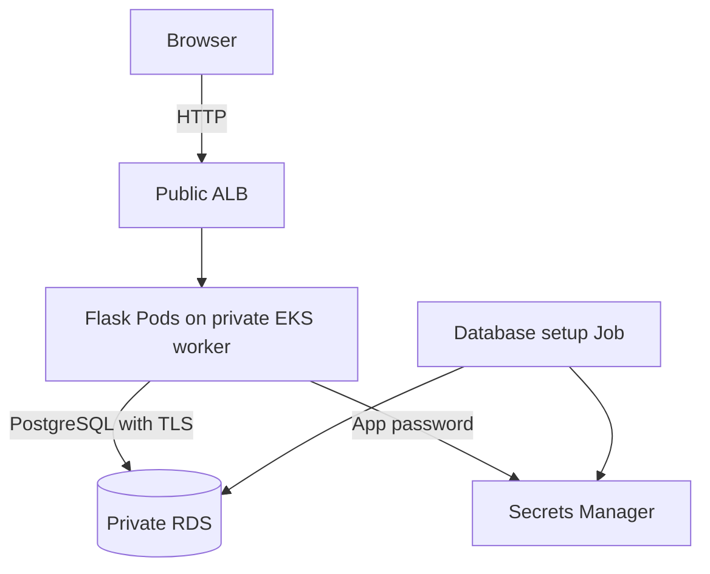

# Architecture

A visitor opens the form through the ALB. Flask receives the three fields and stores them in RDS. The worker running Flask and the database are in private subnets. The database has no route to the public internet. The ALB sits in public subnets.

The VPC covers two Availability Zones. It has public subnets for the ALB, private subnets for EKS and isolated subnets for RDS. One NAT gateway lets the private workers reach AWS services. Using one NAT, one worker and single-AZ RDS costs less for the demo, but each is a possible point of failure.

## How it was deployed

Terraform created the network, EKS, RDS, IAM roles, ECR, logs and empty app secret containers. Ansible built the images, installed the Kubernetes helpers and deployed the app. The **AWS Load Balancer Controller** created the ALB after reading Ansible's Ingress. There is no direct `aws_lb` resource in Terraform.

The ALB accepts public traffic on port 80 and passes it to Flask on port 8000. The database security group allows port 5432 only from the EKS worker security group. The EKS API also has a public address, but only the current operator IP `/32` is allowed to use it. Private EKS API access is enabled too.

## Database passwords

RDS generated its master password in AWS Secrets Manager. A database setup Job generated two more passwords: one for the Flask user that can insert rows, and one for a demo verifier user that can only read rows. The Job stored both in Secrets Manager. Flask reads its app password from a file mounted by the Secrets Store CSI driver and AWS Pod Identity. No password is fixed in Terraform, Ansible or the app source.

The app container runs as a non-root user and has CPU/memory limits and health checks. Its Kubernetes service account cannot list Kubernetes Secrets. EKS control-plane logs and RDS storage encryption are enabled.

The public form still uses **HTTP**. App password rotation is not automatic, and the deployment IAM user still has broad setup permissions. [Security notes](security-controls.md) record these and the other demo limits. [Demo steps](demo-checklist.md) list the commands used to show the design.
