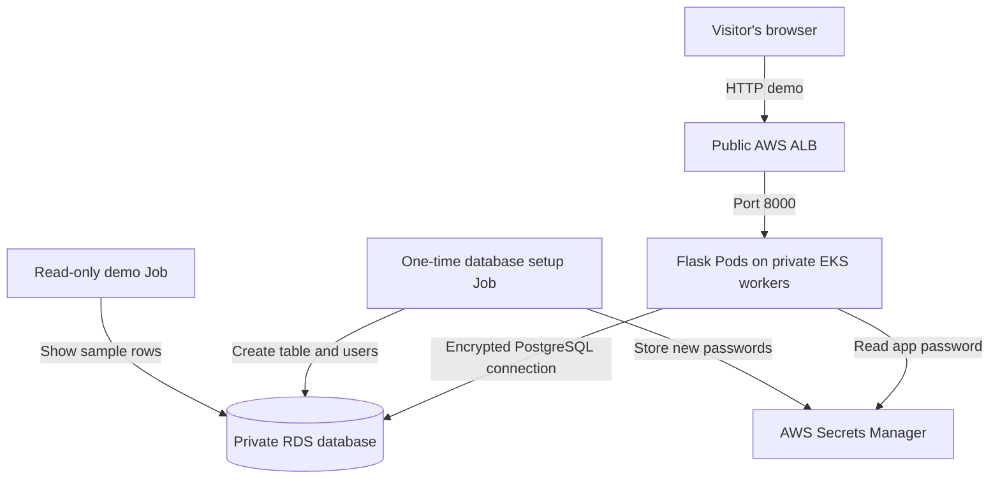

# Architecture: how a form message reaches the database

**In one sentence:** the ALB receives the visitor's request, Flask saves the form in RDS, and Secrets Manager supplies Flask's database login without putting a password in the code.

## Which tool creates each part?

| Part | Who sets it up? | Why? |
| --- | --- | --- |
| VPC (AWS network), public/private/isolated subnets, security groups | Terraform | Keep only the ALB public; keep the app and database in private network areas. |
| EKS, worker nodes, RDS, ECR, IAM roles, logs, secret containers | Terraform | Give the app a place to run, a database, a container image store and controlled access. |
| Container images, Kubernetes Deployment, Service, Ingress and database setup Job | Ansible | Put the app on EKS and connect it to RDS. |
| Actual ALB, listener and targets | AWS Load Balancer Controller | It reads the Ingress made by Ansible and creates the ALB in AWS. |

This last row matters during the interview: **there is no `aws_lb` resource in Terraform**. Terraform provides the ALB's network and IAM permissions; the controller creates the actual ALB from Kubernetes instructions.

## Why there are different network areas

The VPC uses two AWS Availability Zones. In each zone, there is a **public subnet** for the ALB, a **private app subnet** for EKS workers/Pods, and an **isolated database subnet** for RDS. The database subnets have no route to the public internet. The app subnets use one NAT gateway to reach AWS services and download images. That single NAT saves some demo cost but is a single point of failure.

| Who can talk to whom? | Rule in this demo |
| --- | --- |
| Public internet → ALB | Port 80 (HTTP) for the temporary demo. HTTPS needs a domain and ACM certificate. |
| ALB → Flask Pods | App port 8000 through the allowed security groups. |
| EKS workers/Flask → RDS | Database port 5432; RDS is not publicly accessible. |
| Flask identity → Secrets Manager | Read **only** the application secret it needs. |
| My current public IP → EKS API | Allowed from my single `/32` address; EKS's private API is also on. |

The app's Kubernetes service account has no role that lets it list Kubernetes Secrets; the check returned `no`. The Flask container runs as a non-root user with no extra privileges and has CPU/memory limits and health checks. EKS logs and RDS storage encryption are turned on.

## Where the passwords come from

1. RDS generates a **master database password** and keeps it in AWS Secrets Manager.
2. Ansible starts a one-time Job inside EKS. The Job reads the master secret, creates the database table and generates two new passwords: an app user that can insert messages, and a verifier user that can only read rows.
3. The Job saves those passwords as separate Secrets Manager secrets. Flask mounts **only its own** secret as a file through the Secrets Store CSI driver and AWS Pod Identity.
4. Terraform holds secret **names/ARNs**, not password values. No password is printed in the deployment guide.

Automatic rotation of the app and verifier passwords has **not** been set up. The public website also uses HTTP, and the EKS public API is allowed for only the operator's `/32`. These are [documented demo limits](security-controls.md).

## How I explain this in the live demo

“I ran Terraform on my WSL laptop to create the network, EKS, RDS and IAM roles. I then ran Ansible to build and deploy Flask and the Kubernetes Ingress. The AWS controller created the ALB from that Ingress. A made-up form entry reached the private database, and a separate read-only Job showed the saved row. I checked the security settings and documented what I could not enable on my Free Plan.”

Run the [demo checklist](demo-checklist.md) for exact commands. Show **secret metadata only**; never display passwords or the raw audit file.
